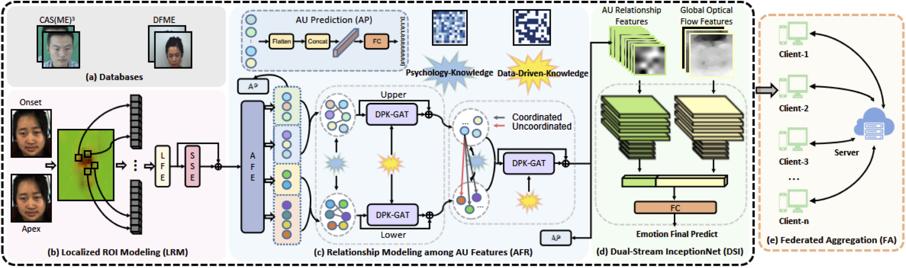

# FED-PsyAU: Privacy-Preserving Micro-Expression Recognition via Psychological AU Coordination and Dynamic Facial Motion Modeling

[](https://iccv2025.thecvf.com/) [](https://opensource.org/licenses/MIT) This repository contains the official PyTorch implementation for the paper: **FED-PsyAU: Privacy-Preserving Micro-Expression Recognition via Psychological AU Coordination and Dynamic Facial Motion Modeling**.

**Code Contributor:** [Yu QIAN (钱雨)](https://github.com/24331454)

---

## Abstract

Micro-expressions (MEs) are brief, low-intensity, often localized facial expressions. They could reveal genuine emotions individuals may attempt to conceal, valuable in contexts like criminal interrogation and psychological counseling. However, ME recognition (MER) faces challenges, such as small sample sizes and subtle features, which hinder efficient modeling. Additionally, real-world applications encounter ME data privacy issues, leaving the task of enhancing recognition across settings under privacy constraints largely unexplored. To address these issues, we propose a FED-PsyAU research framework. We begin with a psychological study on the coordination of upper and lower facial action units (AUs) to provide structured prior knowledge of facial muscle dynamics. We then develop a DPK-GAT network that combines these psychological priors with statistical AU patterns, enabling hierarchical learning of facial motion features from regional to global levels, effectively enhancing MER performance. Additionally, our federated learning framework advances MER capabilities across multiple clients without data sharing, preserving privacy and alleviating the limited-sample issue for each client. Extensive experiments on commonly-used ME databases demonstrate the effectiveness of our approach.



## Key Features

* **Psychological Priors**: Integrates structured prior knowledge of facial muscle dynamics based on the coordination of upper and lower facial action units (AUs).
* **DPK-GAT Network**: A novel network that combines psychological priors with statistical AU patterns for hierarchical learning of facial motion features.
* **Federated Learning Framework**: Enables privacy-preserving ME recognition across multiple clients without direct data sharing, addressing data privacy concerns and limited sample sizes.
* **State-of-the-Art Performance**: Achieves strong performance on challenging micro-expression databases like CAS(ME)³ and DFME.

## Environment Setup

The code is developed and tested on the following environment:

* **OS:** Ubuntu 22.04.3
* **Python:** 3.8.19
* **PyTorch:** 1.13.0
* **GPU:** 5 x NVIDIA GeForce RTXX 4090 (24GB)


## Micro-Expression Databases
* **CAS(ME)³**: We use Part A of this database, which offers 860 samples from 100 participants.
* **DFME**: This database includes three subsets:
    * **DFME-A**: 1,118 samples from 72 participants.
    * **DFME-B**: 969 samples from 92 participants.
    * **DFME-C**: 5,439 samples from 492 participants.

## Pre-training Databases
To enhance the model's ability to perceive facial motion patterns, we first pretrained the AU module (LRM+AFR) on the following datasets:
* **DISFA**
* **CK+**
  
Pease download the datasets from their official sources. For both datasets, we cropped the facial region and computed optical flow features using the TV-L1 method.*

---

## Micro-Expression Recognition (MER) Experiments

### Experiment Settings

* **CAS(ME)$^3$**:
   
  * **3-class classification (positive, negative, surprise).**
  * **Validation**: Leave-One-Subject-Out (LOSO) cross validation.
* **DFME**:
    * **7-class classification (Happiness, Surprise, Disgust, Sadness,fear, Fear, Contempt).**
    * **Validation**: Scale-adapted 10-fold cross-validation.

### Evaluation Metrics

To address the imbalance in ME sample categories, performance is evaluated using:

* Unweighted F1 score (UF1)
* Unweighted Average Recall (UAR)


##  Federated Learning Experiments

### Experiment Settings
* **Client Data Distribution**: The DFME and CAS(ME)$^3$ datasets are randomly split among 5 and 2 local clients,respectively. Each client is assigned an equal number of subjects, which results in heterogeneous data distributions and quantities, simulating a real-world scenario.
* **Validation Stategy**: We use a random partition of 70% for training and 30% for testing. The final results are averaged over 10 separate tests to ennsure robustness.
* **Federated Algorithms**: We evaluate our proposed **P-FedProx** against baselines like **FedAvg** and **FedProx

## Acknowledgements

We extend our gratitude to the creators of the CAS(ME)³, DFME, DISFA, and CK+ datasets for making their valuable data publicly available.

---

## Citation

If you find our work useful for your research, please consider citing our paper.

```bib
@inproceedings{li2025fedpsyau,
  title={FED-PsyAU: Privacy-Preserving Micro-Expression Recognition via Psychological AU Coordination and Dynamic Facial Motion Modeling},
  author={LI, Jingting and Qian, Yu and Zhao, Lin and Wang, Su-Jing},
  booktitle={Proceedings of the IEEE/CVF International Conference on Computer Vision (ICCV) 2025},
  pages={},
  year={2025}


